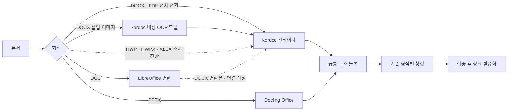

# kordoc 엔진 전환 준비

2026-09-29 결정: **kordoc 4.15.7을 지원 형식의 최종 파싱 엔진으로 선정한다.** HWP·HWPX·DOCX·PDF·XLSX를 순차적으로 통일한다. DOCX와 PDF는 각각 **전체 형식 단위**로 전환한다. 현재 두 스위치의 기본값은 꺼짐이다. 문서 ID별 분기는 없다. 기존 엔진과 같은 문서를 사용한 속도 배속 비교는 아직 없으며, 추가 비교 없이 엔진 선정을 확정했다.

## 확인한 상태

- 전체 전환 스위치: `PARSER_PLATFORM_KORDOC_DOCX_ENABLED=1`, `PARSER_PLATFORM_KORDOC_PDF_ENABLED=1`. 둘 다 기본값 `0`. Kordoc 서비스와 오프라인 OCR 모델이 필요하다.
- 파싱 결과는 기존 `ParsedDocument`로 정규화하고 기존 Word/PDF 청커로 보낸다. 실행 상태 `PARSING_KORDOC`, 파서 버전, 원본 아티팩트를 기록한다. 기본값으로 실행할 때 기존 설정 지문은 유지된다.
- 합성 텍스트 DOCX/PDF의 연결 테스트는 통과했다. 기존 활성 청크는 새 청크의 검증·활성화 전까지 유지하는 구조다. 실제 업무 문서의 내용·표·청크 비교는 남아 있다.
- 폐쇄망에서 내장 OCR 모델을 미리 설치하고 `KORDOC_OFFLINE=1`로 합성 스캔 PDF를 처리했다. `OCR_APPLIED`가 반환되고 이미지 글자 두 줄을 읽었다. 모델 파일은 시험용 임시 디렉터리에만 있으며 저장소·컨테이너 이미지에는 포함하지 않았다.
- DOCX 자체의 `ocr: true`는 삽입 그림을 읽지 않았다. 대신 같은 패키지의 `parseImage` API로 추출 이미지를 OCR하고, 원본 이미지 SHA256을 검증해 해당 위치에 텍스트를 붙였다. 합성 DOCX의 이미지 글자 `ALPHA FUNDING 123`이 **오프라인 OCR → 정규화 → 기존 Word 청킹**까지 전달됐다. 별도 Surya OCR 호출은 없다.
- 이미지 OCR 경로는 PNG/JPEG/GIF/WebP를 허용한다. 직접 실행해 확인한 형식은 PNG와 GIF이며, JPEG/WebP는 지원 API에 근거해 허용했으나 별도 실문서 검증이 남았다. BMP·EMF·WMF 등은 현재 실패 처리한다. 이미지 모델 파일을 배포 위치에 준비하고 실제 DOCX의 내용·표·이미지 품질을 비교하기 전에는 전체 스위치를 켜지 않는다.
- 텍스트 PDF와 스캔 PDF의 내장 OCR 결과는 기존 PDF 청커의 페이지·좌표 형식으로 정규화한다. 이미지 PDF에서 `OCR_APPLIED`가 없거나 OCR 누락 경고가 있으면 실패 처리한다. 합성 문서의 끝까지 연결 시험을 진행 중이며, 실제 업무 PDF 품질 비교는 남아 있다.

## 형식별 전환 이유

| 형식 | kordoc 4.15.7 파싱 | 현재 경로를 유지한 이유 |
|---|---|---|
| DOCX | 가능 | 전체 전환 스위치와 경량 이미지 OCR 연결 완료. 실제 문서 품질·모델 배포 검증 대기 |
| PDF | 가능 | 전체 전환 스위치와 내장 OCR 연결. 합성 스캔 PDF 청킹 및 실문서 품질 검증 대기 |
| HWP·HWPX | 가능 | 독립 파싱·청킹 시험은 했지만 운영 수집 상태·활성화 연결 및 실문서 비교 대기. rhwp는 전환 기간의 기존 경로 |
| XLSX | 가능 | 현재 kordoc IR에서 빈 행/열·병합 셀 원본 주소가 사라져 기존 Excel 청커의 셀 출처를 재현할 수 없음 |
| DOC | 직접 불가 | 실제 DOC가 존재한다. 기존 LibreOffice DOC→DOCX 변환을 분리한 뒤 kordoc으로 보내는 경로를 만들 예정 |
| PPTX | 불가 | kordoc 4.15.7 파싱 대상이 아님. Docling 유지 |

지원 범위는 [kordoc 공식 지원 형식](https://github.com/chrisryugj/kordoc/blob/main/README-EN.md)과 고정 버전의 실제 `parse()` 분기로 확인했다. PPTX는 감지만 하며 `UNSUPPORTED_FORMAT`을 반환한다.

## 컨테이너 처리

1. `kordoc-parser-pilot` 컨테이너는 내부망에만 연결하고 2 CPU/2 GiB로 시작한다. `KORDOC_OCR_MODEL_DIR`의 검증된 `ppocr` 모델을 읽기 전용으로 탑재한다. 모델이 없으면 서비스 건강 상태가 실패한다. 실행 중 다운로드는 허용하지 않는다.
2. 전환 검증 중에는 `docling-office-parser`가 DOC 변환·PPTX·XLSX를 맡는다. 최종적으로 DOC 변환은 LibreOffice 전용 단계로 분리하고, PPTX만 Docling에 남긴다. `surya-parser`는 기존 PDF·Docling Office 이미지 OCR 경로가 남는 동안 유지한다. `rhwp-parser`는 HWP/HWPX 전환과 검증 전까지 유지한다. 각 전환 완료 후 실제 사용 여부를 다시 확인해 축소한다.
3. OCR 연결·실문서 비교·장애 복구 연습이 끝나면 DOCX 전체 스위치를 켠다. 문제 시 스위치를 끄고 재처리하면 기존 Docling 경로를 사용한다. 컨테이너나 이미지는 검증 중 삭제하지 않는다.

이 문서는 전환 준비 상태를 기록한다. 현재 운영 설정을 변경했다는 뜻은 아니다.
